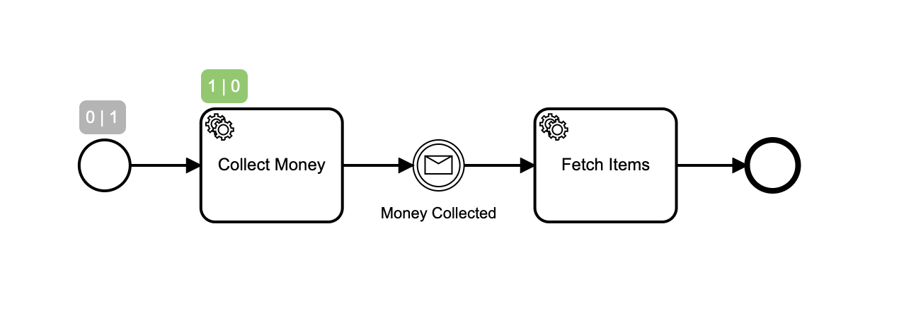
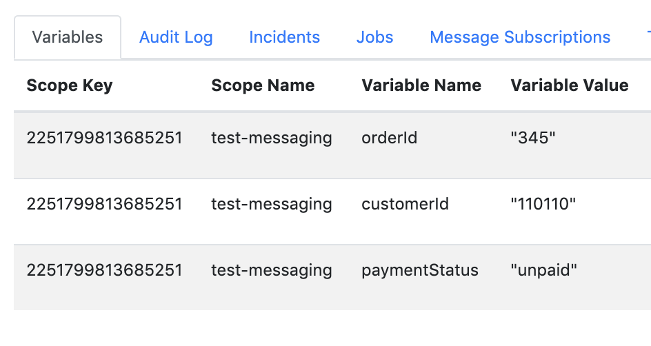
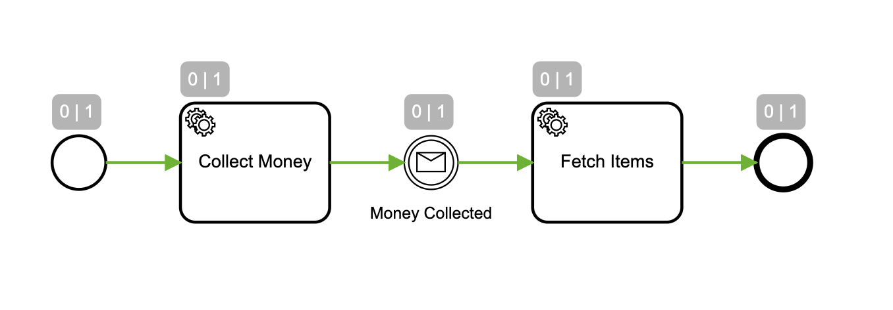

# Zeebe Message Correlation

Message correlation is a powerful feature in Zeebe. It allows you to target a running workflow with a state update from an external system asynchronously. 

This tutorial uses the JavaScript client, but it serves to illustrate message correlation concepts that are applicable to all language clients.

We will use [Simple Monitor](https://github.com/zeebe-io/zeebe-simple-monitor) to inspect the running workflow state. Simple Monitor is a community-supported tool, and is not designed to be used in production - however, it useful during development.

## Workflow

Here is the basic example from [the Zeebe documentation](https://docs.zeebe.io/reference/message-correlation.html):


Use the [Zeebe Modeler](https://github.com/zeebe-io/zeebe-modeler) to open the [test-messaging](bpmn/test-messaging.bpmn) file in this project.

Click on the intermediate message catch event to see how it is configured:


A crucial piece here is the _Subscription Correlation Key_. In a running instance of this workflow, an incoming "_Money Collected_" message will have a `correlationKey` property:

```typescript
  zbc.publishMessage({
    correlationKey: "345",
    name: "Money Collected",
    variables: {
      paymentStatus: "paid"
    });
```

 The concrete value of the message `correlationKey` is matched against running workflow instances, by comparing the supplied value against the `orderId` variable of running instances subscribed to this message. This is the relationship established by setting the correlationKey to `orderId` in the message catch event in the BPMN.

 ## Running the demonstration

 - Clone this repository.

 - Install dependencies:
 ```
 npm i && npm i -g ts-node typescript
 ```

 - In another terminal start the Zeebe Broker using the `simple-monitor` profile from the [zeebe-docker-compose](https://github.com/zeebe-io/zeebe-docker-compose) repo.

 - Deploy the workflow and start an instance:
 ```
 ts-node start-workflow.ts
 ```
This starts a workflow instance with the `orderId` set to 345:
 ```typescript
await zbc.createWorkflowInstance("test-messaging", {
      orderId: "345",
      customerId: "110110",
      paymentStatus: "unpaid"
    })
 ```

 - Now open Simple Monitor at [http://localhost:8082](http://localhost:8082)

 - Click on the workflow instance. You will see the current state of the workflow:

 
This means that 0 tokens are waiting at the start event, and 1 has passed through; and 1 token is waiting at the "Collect Money" task, and 0 have passed through.

- Take a look at the "Variables" tab at the bottom of the screen. (If you don't see it you are probably looking at the workflow, rather than the instance. In that case, drill down into the instance):

You can see that this workflow instance has the variable `orderId` set to the value 345.

- Now start the workers:
```
ts-node workers.ts
```
- Refresh Simple Monitor to see the current state of the workflow:

Now the token is at the message catch event, waiting for a message to be correlated.

- Take a look at the "Message Subscriptions" tab:

You can see that the broker has opened a message subscription for this workflow instance with the concrete value of the `orderId` 345. This was created when the token entered the message catch event.

- Now send the message, in another terminal:
```
ts-node send-message.ts
```

- Refresh Simple Monitor, and you see that the message has been correlated and the workflow has run to completion:


The "Message Subscriptions" tab now reports that the message was correlated:


## Message Buffering

Messages are buffered on the broker, so your external systems can emit messages before your process arrives at the catch event. The amount of time that a message is buffered is configured when publishing the message from the client library.

For example, to send a message that is buffered for 10 minutes with the JavaScript client:

```typescript
  zbc.publishMessage({
    correlationKey: "345",
    name: "Money Collected",
    variables: {
      paymentStatus: "paid"
    },
    timeToLive: 600000
  });
```

Here is how you can see it in action:

- Keep the workers running.
- Publish the message:
```typescript
ts-node send-message.ts
```
- Click on "Messages" at the top of the Simple Monitor page. You will see the message buffered on the broker:


- Now start another instance of the workflow:
```typescript
ts-node start-workflow.ts
```

You will see that the message is correlated to the workflow instance, even though it arrived before the workflow instance was started.

## Common Mistakes

A couple of common gotchas:

- The `correlationKey` in the BPMN message definition is the name of the workflow variable to match against. The `correlationKey` in the message is the concrete value to match against that variable in the workflow instance. Arguably, it might be more appropriately named `correlationValue` to make this distinction clearer. There is [a GitHub issue](https://github.com/zeebe-io/zeebe/issues/2718) around that - feel free to add your feedback.

 - An important thing to know is that the message subscription _is not updated after it is opened_. That is not an issue in the case of a message catch event, however for boundary message events (both interrupting and non-interrupting) the subscription is opened as soon as the token enters the bounding subprocess. If any service task modifies the `orderId` value inside the subprocess, the subscription will not be updated. If you need a boundary message event correlated on a value that is modified somewhere in your process, then put the boundary message event in a subprocess after the task that sets the variable. The message subscription for the boundary message event will be opened when the token enters the subprocess, with the current variable value.
